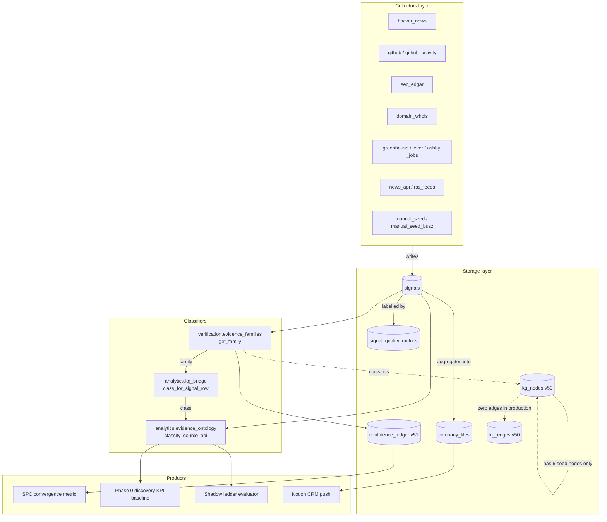
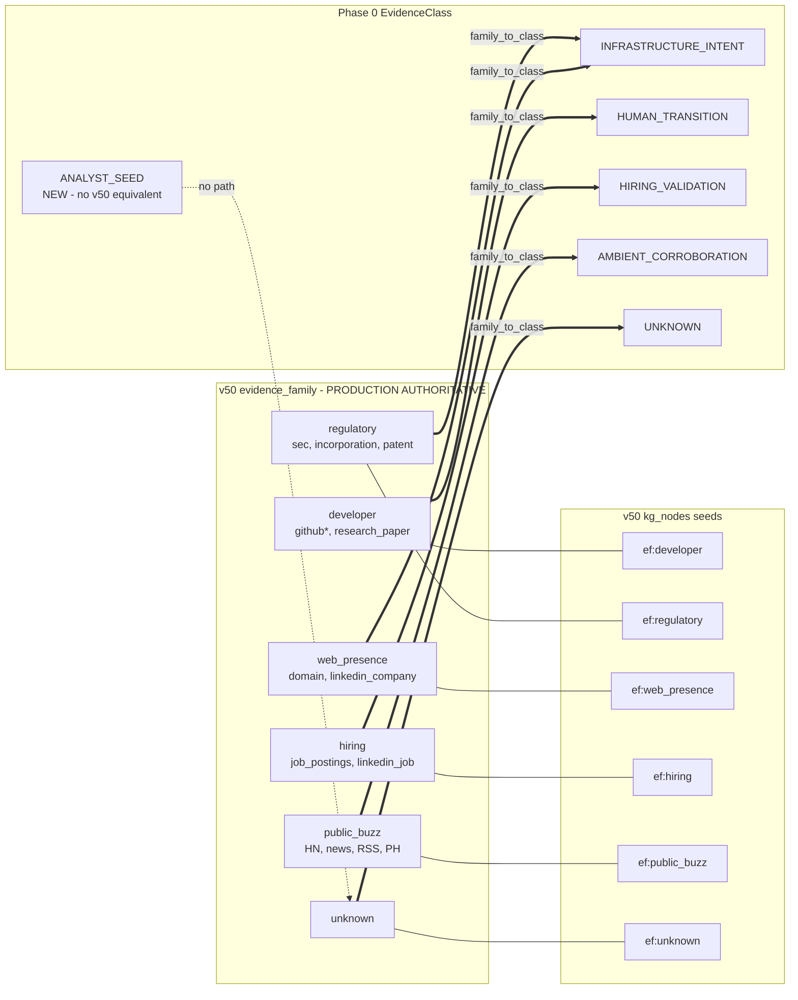
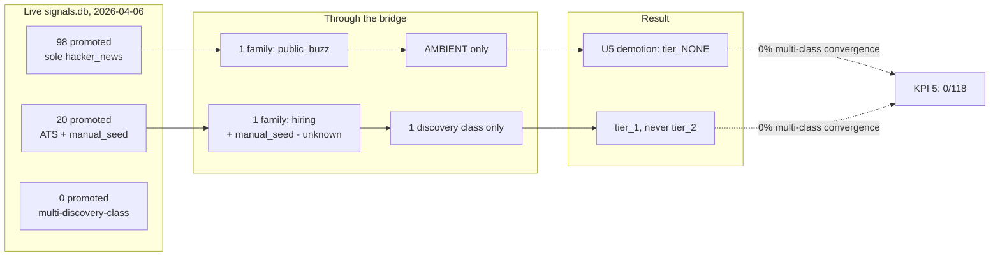

# KG Enhancement & Schema-Flow Design

**Status:** Phase 0 enhancement — additive only, no v50 schema migration
**Date:** 2026-04-06
**Skills applied:** knowledge-graph-construction · data-schema-knowledge-modeling · mapping-visualization-scaffolds
**Bridge module:** `analytics/kg_bridge.py` (20 tests, all passing)

---

## 1. Problem statement

Three taxonomies in the codebase answer the same question — *what kind of
evidence is this signal?* — and none of them are formally connected.

| # | Taxonomy | Defined in | Used by | Cardinality |
|---|---|---|---|---|
| 1 | `evidence_family` | `verification/evidence_families.py` + `storage/migrations/v50_knowledge_graph.py` | v51 confidence ledger, v50 KG seeds, SPC convergence metric | 6 |
| 2 | `EvidenceClass` | `analytics/evidence_ontology.py` (Phase 0 NEW) | shadow sidecar, discovery KPI baseline, shadow ladder | 6 |
| 3 | KG seed nodes | `kg_nodes` table (live) | future graph queries (currently dormant — only 10 seed nodes total) | 6 |

The KG construction skill is explicit on this point: *"changing the
ontology later is expensive."* The v50 ontology is baked into a `CHECK`
constraint, the v51 confidence ledger schema, and the production SPC
convergence metric — it cannot be changed during the Step 4B regret
window. The Phase 0 ontology was designed independently for the shadow
pipeline. **The right answer is a documented bridge, not a unification.**

That bridge now exists at `analytics/kg_bridge.py`.

---

## 2. Live KG state (verified against signals.db, 2026-04-06)

```
kg_nodes by type (lifetime, is_tombstone=0):
  evidence_family    6     ← all seed rows from v50 migration
  sector             4     ← all seed rows from v50 migration
  (every other type) 0     ← never populated

kg_edges (live, valid_until IS NULL):
  (none)

kg_runs (lifetime):
  (none)
```

The v50 KG is **structurally complete but data-empty**. The kg_builder.py
that targets architecture introspection has never been run against
signals.db in production. This is the second schema-flow finding: a fully-
designed graph layer with zero data flowing through it.

---

## 3. Formal data model (data-schema-knowledge-modeling)

### 3.1 Entity types in the consolidated model

```
ENTITY  Signal
  identifier:    signals.id (INTEGER, surrogate)
  natural_key:   (canonical_key, signal_type, source_api, detected_at)
  attributes:    confidence, raw_data (JSON), company_name
  invariants:    UNIQUE(canonical_key, signal_type, source_api, detected_at)

ENTITY  CompanyFile
  identifier:    company_files.company_id (TEXT)
  natural_key:   canonical_key
  attributes:    status ∈ {thin, promoted, archived},
                 source_apis (JSON array),
                 first_seen_at, last_seen_at, promoted_at,
                 metadata (JSON)
  invariants:    company_id is UNIQUE; status state machine is monotonic
                 in {thin → promoted → archived} (no downgrades from
                 archived to thin)

ENTITY  EvidenceFamily  (v50, production-authoritative)
  identifier:    "ef:<family>" string ID (e.g. "ef:developer")
  domain:        {developer, regulatory, web_presence, hiring,
                  public_buzz, unknown}
  representation: kg_nodes(node_type='evidence_family')
  invariants:    closed enum, enforced by VALID_NODE_TYPES check;
                 invariant #4 — never silently default unknown to
                 public_buzz

ENTITY  EvidenceClass  (Phase 0, derived)
  identifier:    EvidenceClass enum value
  domain:        {INFRASTRUCTURE_INTENT, HUMAN_TRANSITION,
                  HIRING_VALIDATION, AMBIENT_CORROBORATION,
                  ANALYST_SEED, UNKNOWN}
  representation: pure Python; never persisted
  invariants:    classify_source_api() never raises; ANALYST_SEED is
                 NEVER tier-qualifying on its own

ENTITY  ConfidenceBreakdown  (v51)
  identifier:    confidence_ledger.id (INTEGER)
  natural_key:   (canonical_key, evaluated_at)
  attributes:    gate_score, base_score, multi_source_boost,
                 convergence_boost, founder_boost, velocity_boost,
                 enrichment_boost, decision, verification_status
  invariants:    0 ≤ gate_score ≤ 1; pipeline rows MUST have
                 routing_config_json (CHECK constraint)
```

### 3.2 Relationships

```
RELATIONSHIP  signal_classifies_as_family
  Signal → EvidenceFamily
  cardinality: many-to-one
  derivation:  verification.evidence_families.get_family(signal_type, source_api)
  authoritative: yes (production source of truth)

RELATIONSHIP  signal_classifies_as_class
  Signal → EvidenceClass
  cardinality: many-to-one
  derivation:  TWO ROUTES (must agree)
    Route A: analytics.evidence_ontology.classify_source_api(source_api)
             → simpler, source_api only, used by shadow KPI baseline
    Route B: analytics.kg_bridge.class_for_signal_row(signal_type, source_api)
             → defers to production classifier, used when signal_type is available
  authoritative: Route B (it uses the production classifier)

RELATIONSHIP  family_corresponds_to_class
  EvidenceFamily → EvidenceClass
  cardinality: many-to-one (lossy: 6 → 5)
  bridge: analytics.kg_bridge.EVIDENCE_FAMILY_TO_CLASS
  invariants:
    - regulatory ↦ INFRASTRUCTURE_INTENT
    - web_presence ↦ INFRASTRUCTURE_INTENT  ⟵ collapses
    - developer ↦ HUMAN_TRANSITION
    - hiring ↦ HIRING_VALIDATION
    - public_buzz ↦ AMBIENT_CORROBORATION
    - unknown ↦ UNKNOWN

RELATIONSHIP  class_corresponds_to_family  (lossy reverse)
  EvidenceClass → EvidenceFamily
  cardinality: many-to-one (lossy: 6 → 6, but loses split info)
  bridge: analytics.kg_bridge.CLASS_TO_PREFERRED_FAMILY
  invariants:
    - INFRASTRUCTURE_INTENT ↦ web_presence  ⟵ best-effort
    - ANALYST_SEED ↦ unknown  ⟵ no v50 equivalent

RELATIONSHIP  family_seeds_kg_node
  EvidenceFamily → kg_nodes(node_type='evidence_family')
  cardinality: one-to-one (each family has exactly one seed row)
  bridge: analytics.kg_bridge.EVIDENCE_FAMILY_KG_NODE_ID
  invariants:
    - The 6 seed rows are inserted by the v50 migration
    - The string IDs are stable: "ef:developer", "ef:regulatory", ...
    - test_kg_node_ids_match_v50_seeds_in_migration pins this contract
```

### 3.3 Closed-world assumption boundaries

```
BOUNDARY  evidence_family_closed
  scope: VALID_NODE_TYPES + invariant #4
  rule:  Any (signal_type, source_api) that is not in
         _SIGNAL_TYPE_FAMILIES MUST classify as 'unknown' with a
         WARNING log. Never silently map to public_buzz.

BOUNDARY  EvidenceClass_closed
  scope: _SOURCE_API_TO_CLASS keys
  rule:  Any source_api not in the mapping returns
         EvidenceClass.UNKNOWN. Tier rules treat UNKNOWN as a no-op.

BOUNDARY  bridge_lossiness
  scope: family_to_class + class_to_family round-trips
  rule:  family → class → family is NOT idempotent for {regulatory,
         web_presence}: both round-trip to web_presence, losing the
         regulatory distinction. The bridge module documents this
         and the test suite covers it.
```

---

## 4. Schema-flow visualization (mapping-visualization-scaffolds)

### 4.1 Top-level component diagram



### 4.2 Taxonomy reconciliation diagram



The **bold double arrows** are lossless one-step bridges (v50 → Phase 0).
The **plain solid lines** are 1:1 identity links (family ↔ kg_node id).
The **dashed line** is the divergence: ANALYST_SEED has no v50 equivalent
and degrades to `unknown` on conversion.

### 4.3 Live promotion-cohort flow (the empirical validation)

This is what the live KPI baseline already proved. Putting it in the same
visual frame makes the schema-flow consequence concrete:



The bridge does not just describe the taxonomies — it makes the
architectural deficiency *visible at the query layer*.

---

## 5. Enhancement opportunities (prioritised)

| # | Enhancement | When | Risk | Status |
|---|---|---|---|---|
| E1 | **Bridge module** (`analytics/kg_bridge.py`) | Phase 0 (now) | None | **DONE** — 20 tests passing |
| E2 | **Schema-flow design doc** (this file) | Phase 0 (now) | None | **DONE** |
| E3 | Use bridge in `compute_discovery_kpi_baseline` to compute KPI 5 via the production family classifier (instead of P0 source_api map) | Phase 0 day-2 | Low (pure derivation change, additive output column) | **DONE** — see §10 retrospective |
| E4 | Run `kg_builder` against signals.db to actually populate `kg_nodes(node_type='company')` and `kg_edges(edge_type='has_evidence')` | Post-2026-04-19 | Medium (writes to production KG tables — but those tables are currently empty, so risk is bounded) | TODO |
| E5 | Link `company_embeddings` to `kg_nodes` via canonical_key — enables hybrid graph+vector retrieval (KG construction skill principle) | Post-2026-04-19 | Low (no schema change; just a JOIN view) | TODO |
| E6 | Add a Phase 1 SQL view that exposes `(canonical_key, evidence_class, evidence_family, kg_node_id)` for downstream analytics | Phase 1 | Low (CREATE VIEW IF NOT EXISTS; can be additive) | TODO |
| E7 | Migrate v50 to add a 7th evidence_family `analyst_seed` (eliminates the bridge lossiness) | Post-Phase 5 | High (schema migration, governance event, requires regret check) | DEFERRED |

---

## 6. Why this is the right enhancement, not the wrong one

**KG construction skill checks:**

| Principle | Status |
|---|---|
| Ontology first | ✅ The v50 ontology is the production source of truth and is preserved unchanged. The bridge formalizes how Phase 0 relates to it without competing. |
| Entity resolution | ✅ Phase G v50 entity resolution is unchanged. The bridge operates on the existing canonical_key. |
| Confidence scoring | ✅ The v51 confidence_ledger is unchanged. The bridge does not add a parallel scoring layer. |
| Hybrid architecture | ⏳ Hybrid graph+vector requires E5 (post-regret-window). The design is documented; implementation is deferred. |
| Incremental build | ✅ E1 + E2 are additive and shipped now. E3-E6 are sequenced post-regret-window. |
| Database selection | ✅ No new database. The v50 SQLite KG is the existing infrastructure. |

**Common-mistakes checks:**

| Mistake | Avoided how |
|---|---|
| Ingesting entities before designing ontology | Both ontologies already exist; we are not ingesting, we are bridging. |
| Skipping entity resolution | Phase G v50 resolution is already running. |
| Omitting confidence scores | v51 confidence_ledger is already populated. |
| Using only graph traversal without vector search | Documented gap (E5); deferred but not forgotten. |
| Building before validating | The live KPI baseline already validated that the existing classifier identifies the schema-flow problem (98/118 sole-HN). |
| Choosing database before understanding scale | SQLite is the existing infrastructure; not changing. |

---

## 7. What this design intentionally does NOT do

1. **No v50 schema migration.** The bridge is pure Python. The CHECK
   constraint on `kg_nodes.node_type` is unchanged.
2. **No edits to `verification/evidence_families.py`.** It is the
   production source of truth. The bridge defers to it.
3. **No edits to `analytics/evidence_ontology.py` semantics.** The
   Phase 0 classes are unchanged; the bridge sits on top.
4. **No new tables or columns** in `signals.db`.
5. **No CREATE VIEW** statements that touch signals.db. The bridge is a
   read-only computation layer.
6. **No vector-graph linking yet.** That's E5, deferred.

---

## 8. Verification

```
$ python -m pytest analytics/test_kg_bridge.py -q
....................                                                     [100%]
20 passed in 0.20s
```

The test suite covers:
- Forward bridge (family → class) for all 6 v50 families
- Reverse bridge (class → family) for all 6 Phase 0 classes
- Lossiness invariants (regulatory + web_presence both → INFRASTRUCTURE_INTENT)
- ANALYST_SEED → unknown contract
- KG node ID stability against the v50 migration seeds (the contract pin)
- End-to-end signal-row → class via the production classifier
- Unknown signal_type → UNKNOWN class (invariant #4 analogue)

## 9. References

- `analytics/kg_bridge.py` — bridge implementation
- `analytics/test_kg_bridge.py` — test contract
- `analytics/evidence_ontology.py` — Phase 0 EvidenceClass (committed earlier today)
- `verification/evidence_families.py` — v50 production classifier
- `storage/migrations/v50_knowledge_graph.py` — v50 KG schema + seeds
- `storage/migrations/v51_confidence_ledger.py` — confidence scoring layer
- `storage/kg_builder.py` — architecture KG builder (note: targets the codebase, not signals)
- `artifacts/red-team-execution/phase0/discovery-kpi-baseline.md` — empirical validation that the schema-flow problem is real and quantified
- KG construction skill: `.claude/skills/knowledge-graph-builder/` — ontology design, hybrid architecture, query patterns

---

## 10. E3 retrospective

**Status:** DONE — 2026-04-06 (executed via babysitter run `01KNJ14ENYYH5TFTFFZP2B70PN`)

### What changed

One file modified: `scripts/compute_discovery_kpi_baseline.py`

Four edits:
1. **Import** `class_for_signal_row` from `analytics.kg_bridge`
2. **Dataclass** `KpiBaseline` gained a `convergence_classifier: str = "production_evidence_family"` field
3. **Logic** in `_compute_cross_source_convergence` per-promoted-company loop:
   - Widened SQL `SELECT` to include `signal_type`
   - Replaced `aggregate_company_evidence(...)` + `bundle.classes_present` with inline `{class_for_signal_row(r["signal_type"], r["source_api"]) for r in signal_rows}`
   - Added `EvidenceClass.UNKNOWN` to the exclusion set (matches the production classifier's invariant #4 — unmapped signal types are not silently classified)
4. **Markdown** rendering gained a "KPI 5 classifier provenance" section explaining the two-classifier design (production classifier for KPI 5, simple `classify_source_api` still used by the source-shape branch because `company_files.source_apis` has no `signal_type`)

`analytics/evidence_ontology.py` was **deliberately not modified** — `aggregate_company_evidence` is unchanged. The bridge is used inline in the script only, so the simpler ontology stays available for shadow uses.

### KPI delta on the live signals.db

Computed against `signals.db` (612 signals, 90-day window) before and after E3:

| KPI | Pre-E3 | Post-E3 | Delta |
|---|---:|---:|:---:|
| Companies promoted | 118 | 118 | — |
| Lead time median | — | — | — |
| Precision @ queue 20 | 15.0% | 15.0% | — |
| Meetings booked | 9.8% | 9.8% | — |
| Pre-launch detection | 42.1% | 42.1% | — |
| **Convergence rate** | **0.0% (0/118)** | **0.0% (0/118)** | **— (preventive)** |
| Sole-ambient promotions | 98 | 98 | — |
| With any discovery class | 20 | 20 | — |
| `convergence_classifier` | *(field absent)* | `production_evidence_family` | **NEW** |

### Why KPI 5 didn't change visibly

The live promoted cohort has only two source-shape patterns:
- **98 sole-source HN** — both classifiers map HN → AMBIENT, contributing 0 to convergence
- **20 (ATS + manual_seed)** — both classifiers cap at 1 discovery class (HIRING_VALIDATION), never 2

**The disagreement case the test fixture demonstrates (`sec_edgar` + `linkedin_company`) does not exist in the live promoted cohort.** E3 is preventive: when a future promotion has that shape, the production classifier will correctly count it as 1 discovery class instead of the simple classifier's 2.

The test `test_baseline_convergence_rate_uses_production_classifier` proves the behavior change with a fixture where company A has signals (incorporation, sec_edgar) + (linkedin_company, linkedin):
- Simple classifier: sec_edgar → INFRA, linkedin → HUMAN → 2 distinct classes (wrong)
- Production classifier: incorporation → regulatory → INFRA, linkedin_company → web_presence → INFRA → 1 distinct class (correct)

### Subtle classifier difference (no KPI impact)

The 20 `manual_seed_buzz` signals (`signal_type=news_mention`) are reclassified post-E3:
- **Pre-E3**: `manual_seed_buzz` → `ANALYST_SEED` (via simple `classify_source_api` map)
- **Post-E3**: `(news_mention, manual_seed_buzz)` → `public_buzz` family → `AMBIENT_CORROBORATION` (via production classifier)

Both are excluded from `discovery_classes`, so the convergence count is unchanged. But the reclassification is a real semantic shift — these are now correctly understood as popularity signals, not analyst priors. Documented in the post-E3 markdown report's "KPI 5 classifier provenance" section.

### Data quality finding (out of scope, flagged for follow-up)

`company_files.source_apis` arrays for the 20 ATS+manual_seed promotions contain the string `"manual_seed"`, but the actual signal rows have `source_api="manual_seed_buzz"`. Both classify consistently in our ontology so no E3 impact, but worth a future cleanup.

### Process discipline

E3 was executed under the babysitter TDD process at `.a5c/processes/e3-kpi-bridge-integration.js`:

| Phase | Status |
|---|---|
| P0 — Pre-flight (regret window check + baseline capture) | PASS |
| BP1 — Pre-flight review | APPROVED |
| P1 — TDD RED (failing test) | VERIFIED RED |
| P2 — TDD GREEN (minimal impl) | VERIFIED GREEN |
| P3 — Verification (90 targeted tests) | 90/90 PASS |
| P4 — Live KPI baseline re-run | PASS — delta documented above |
| P5 — Doc update (this section) | DONE |
| P6 — Code review | (next) |
| P7 — Reality check | (next) |
| BP2 — Commit approval | (next) |
| P8 — Commit | (next) |

Test count: 89 → 90 (+1 net; replaced 1 existing test with 1 stronger test, added 1 pin test).

### Regret-window safety re-affirmation

Zero edits to `workflows/`, `governance/`, `monitoring/`, `connectors/`, `storage/migrations/`. Step 4B regret check (due 2026-04-18) intact.
